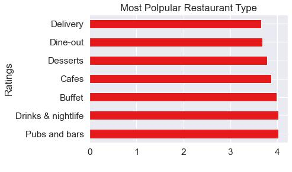

**Building Machine Learning Pipelines:**

**Problem Statement:**

The main goal of this project is to perform extensive Exploratory Data Analysis(EDA) on the Zomato Dataset and build an appropriate Machine Learning Model that will help various Zomato Restaurants to predict their respective Ratings based on certain features.

**the Lifecycle In A Data Science Projects**

1.  Data Preprocessing(EDA) --done
1.  Data Wrangling --done
1.  Data Analysis -- done
1.  Feature engineering --done
1.  Model Building --done
1.  Model Deployment --done

**Step1. Data Pre Processing(EDA)**
zomato_df.info()    

|                                         |         |                |          |        |
|-----------------------------------------|-----------------------------|----------------|----------|--------|
||                |          |        |
| \#                                      | Column                      | Non-Null Count | Dtype    |        |
| ---                                     | ------                      | -------------- | -----    |        |
| 0                                       | url                         | 51717          | non-null | object |
| 1                                       | address                     | 51717          | non-null | object |
| 2                                       | name                        | 51717          | non-null | object |
| 3                                       | online_order                | 51717          | non-null | object |
| 4                                       | book_table                  | 51717          | non-null | object |
| 5                                       | rate                        | 43942          | non-null | object |
| 6                                       | votes                       | 51717          | non-null | int64  |
| 7                                       | phone                       | 50509          | non-null | object |
| 8                                       | location                    | 51696          | non-null | object |
| 9                                       | rest_type                   | 51490          | non-null | object |
| 10                                      | dish_liked                  | 23639          | non-null | object |
| 11                                      | cuisines                    | 51672          | non-null | object |
| 12                                      | approx_cost(for two people) | 51371          | non-null | object |
| 13                                      | reviews_list                | 51717          | non-null | object |
| 14                                      | it                          | 51717          | ll       | bj t   |

**Data Description**

1.  **url :** contains the url of the restaurant in the zomato website
1.  **address :** contains the address of the restaurant in Bengaluru
1.  **name :** contains the name of the restaurant
1.  **online_order :** whether online ordering is available in the restaurant or not
1.  **book_table :** table book option available or not
1.  **rate :** contains the overall rating of the restaurant out of 5
1.  **votes :** contains total number of rating for the restaurant as of the above mentioned date
1.  **phone :** contains the phone number of the restaurant
1.  **location :** contains the neighborhood in which the restaurant is located
1.  **rest_type :** restaurant type
1.  **dish_liked :** dishes people liked in the restaurant
1.  **cuisines :** food styles, separated by comma
1.  **approx_cost(for two people) :** contains the approximate cost of meal for two people
1.  **reviews_list :** list of tuples containing reviews for the restaurant, each tuple
1.  **menu_item :** contains list of menus available in the restaurant
1.  **listed_in(type) :** type of meal
1.  **listed_in(city) :** contains the neighborhood in which the restaurant is listed

**Step.1.B. Data Analysis**

**Univariate Analysis**

**Numerical Features**

**1. rating**

In [32]: *\# distribution of the rating feature*

plt.figure(figsize**=**(10,4))

sns.distplot(zomato_df.rating)

plt.ylabel(' ')

plt.title('Distribution of rating')

plt.show()

In [33]: *\# plotting pie chart for rating feature*

​

*\# creating labels and pie chart slices*

labels **=** ['poor', 'average', 'good','very good']

rating_sizes **=**[((zomato_df['rating']**\>=**1) **&** (zomato_df['rating']**\<**2)).sum(), ((zomato_df['rating']**\>=**2) **&** (zomato_df['rating']**\<**3)).sum(), ((zomato_df['rating']**\>=**3) **&** (zomato_df['rating']**\<**4)).sum(), (zomato_df['rating']**\>=**4).sum()

]

​

In [34]: *\# plotting pie chart*

explode **=** (0.03, 0.03, 0.03, 0.03)

​

plt.pie(rating_sizes, labels**=**labels, autopct**=**'%1.1f%%', pctdistance**=**0.70,explode**=**explode)

​

*\# draw circle*

centre_circle **=** plt.Circle((0, 0), 0.50, fc**=**'white')

fig **=** plt.gcf()

*\# Adding Circle in Pie chart*

fig.gca().add_artist(centre_circle)

plt.title("rating % overall ")

plt.show()

**insights:**

1.  rating feature is normaly distributed.
1.  good rating(\>=3 and \<4) is the highly rated.
1.  **approx_cost(for two people)**

In [35]: plt.figure(figsize**=**(15,5))

sns.histplot(zomato_df,x**=**'approx_cost(for two people)',bins**=**range(0, 3000, 100))

plt.xticks(range(0,3000,200))

plt.xlabel('food cost range')

plt.ylabel(" ")

plt.title("Range of cost of food for two person")

plt.show()

**Insights:**

1.  In bengaluru the food cost range mostly is between 300-400 for two person.
1.  this feature is skewed towards left that means this features has some high value outliers.
1.  **votes**

In [36]: *\# distribution of the rating feature*

plt.figure(figsize**=**(10,4))

sns.distplot(zomato_df.votes)

plt.ylabel(' ')

plt.title('Distribution of votes')

plt.show()

In [37]: plt.figure(figsize**=**(15,5))

sns.histplot(zomato_df,x**=**'votes',bins**=**range(0,2500,100))

plt.xticks(range(0,2500,200))

plt.xlabel('vote range')

plt.ylabel(" ")

plt.title("Vote range distribution")

plt.show()

**Insight:**

1.  Vote feature is highly skewed towards left, which leads towards high value outliers.
1.  most of the votes are fall under range from 0-100.

**Categorical Features**

**4. name feature**

In [38]: plt.figure(figsize**=**(10,5))

top_15_restaurants**=**zomato_df.groupby(['name'])['name'].count().sort_values(ascending**=False**).head(15)

sns.barplot(x**=**top_15_restaurants,y**=**top_15_restaurants.index)

plt.xlabel('No of branches')

plt.ylabel(' ')

plt.title('Top 15 Resaurants with maximum branches')

plt.show()

**Insight:**

1.  Cafe coffe day has highest no of branches in bengaluru.
1.  **dish_liked**

In [39]: *\# creating temporary dataframe without null values of dish_liked for visualisation* df_dishes**=**zomato_df[**\~**zomato_df.dish_liked.isnull()]

In [40]: *\# plotting word cloud for most liked dishes*

​

plt.figure(figsize**=**(10,10))

text **=** " ".join(dish **for** dish **in** df_dishes.dish_liked)

​

*\# Create and generate a word cloud image:*

wordcloud **=** WordCloud(max_font_size**=**50, max_words**=**100, background_color**=**"white").generate(text)

​

-   *Display the generated image:* plt.imshow(wordcloud, interpolation**=**'bilinear') plt.axis("off")

plt.show()

**6. cuisines**

In [41]: *\# creating temporary dataframe without null values of cuisines for visualisation* df_cuisine**=**zomato_df[**\~**zomato_df.cuisines.isnull()]

-   *plotting word cloud for most offered cuisines*

    ​

plt.figure(figsize**=**(10,10))

text **=** " ".join(cuis **for** cuis **in** df_cuisine.cuisines)

​

-   *Create and generate a word cloud image:*

wordcloud **=** WordCloud(max_font_size**=**50, max_words**=**100, background_color**=**"white").generate(text)

​

-   *Display the generated image:* plt.imshow(wordcloud, interpolation**=**'bilinear') plt.axis("off")

plt.show()

**Insight:**

1\. North indian type cuisines is most offered type cuisines by restaurants.

**Insight:** so most liked dishes are chicken biryani,mutton biryani and butter chicken

**7.online_order & book_table**

In [42]: plt.figure(figsize**=**(10,7))

plt.subplot(1,2,1)

zomato_df.online_order.value_counts(normalize**=True**).plot.pie()

plt.xlabel('Take online order')

plt.ylabel('')

​

plt.subplot(1,2,2)

zomato_df.book_table.value_counts(normalize**=True**).plot.pie()

plt.xlabel('Book Table on Request')

plt.ylabel(' ')

plt.show()

**Insight:**

1.  Most of the restaurant take online order.
1.  Most of the restaurant dont take Book table request.
1.  **rest_type**

In [43]: plt.figure(figsize**=**(10,12))

plt.subplot(2,1,1)

zomato_df.rest_type.value_counts().head(10).plot.barh()

plt.title('Top 10 No of Restaurant Type')

plt.subplot(2,1,2)

zomato_df.rest_type.value_counts().tail(10).plot.barh()

plt.title('Bottom 10 No of Restaurant type')

plt.show()

**Insight:**

1.  The most restaurant type availbale is Quick bites which is very obvious.
1.  Food court type restaurant is not very much available.

**Bivariate Analysis with respect to target variable**

**1. rating vs approx cost /two person**

In [44]: plt.figure(figsize**=**(15,5))

sns.scatterplot(zomato_df.rating,zomato_df['approx_cost(for two people)'],hue**=**zomato_df.rating,palette**=**'autumn_r')

plt.legend(loc**=**'upper left')

plt.ylabel('food cost')

plt.title('Rating vs cost of food')

plt.show()

**Insights:**

1.  as already observed most of the rating was between 3.0-4.0 and between this range the cost of food is about 2000, yes there are still some cost is about 4000 for two person, which is clearly an oulier.
    1.  as the rating of restaurant increases the cost of the food is also increases.
1.  But still for rating range between 4.5-5 the cost of food is about 2000.
1.  Expensive restaurant rating ranges from 4.0-4.5.
1.  **Rating vs no of votes registered**

In [45]: plt.figure(figsize**=**(15,5))

sns.scatterplot(zomato_df.rating,zomato_df.votes,hue**=**zomato_df.rating,palette**=**'autumn_r')

plt.ylabel('food cost')

plt.title('Rating vs cost of food')

plt.show()

**Insight:**

1.  most of votes are registered around 4.5.
1.  observed some outliers here too.
1.  **Top 10 Highly vs Least Rated Restaurant**

In [46]: plt.figure(figsize**=**(10,15))

​

df1**=**zomato_df[**\~**zomato_df.rating.isnull()]

rest_rating_df**=**df1.groupby(['name'])['rating'].mean().sort_values(ascending**=False**)

​

top_10**=**rest_rating_df.head(10)

bottom_10**=**rest_rating_df.tail(10)

​

plt.subplot(2,1,1)

sns.barplot(y**=**top_10.index,x**=**top_10)

plt.ylabel(' ')

plt.title('Top 10 Highly Rated Restaurant')

​

plt.subplot(2,1,2)

sns.barplot(y**=**bottom_10.index,x**=**bottom_10)

plt.ylabel(' ')

plt.title('Top 10 Least Rated Restaurant')

​

plt.show()

**Insight:**

1.  Asia Kitchen by Mainland china is the highly rated restaurant.
1.  Alibi-Maya International Hotel is the least rates restaurant.
1.  **Most and least popular location**

In [47]: plt.figure(figsize**=**(10,15))

​

df1**=**zomato_df[**\~**zomato_df.rating.isnull()]

loc_rating_df**=**df1.groupby(['location'])['rating'].mean().sort_values(ascending**=False**)

​

top_10**=**loc_rating_df.head(10)

bottom_10**=**loc_rating_df.tail(10)

​

plt.subplot(2,1,1)

sns.barplot(y**=**top_10.index,x**=**top_10)

plt.ylabel(' ')

plt.title('Top 10 Most Popular Location')

​

plt.subplot(2,1,2)

sns.barplot(y**=**bottom_10.index,x**=**bottom_10)

plt.ylabel(' ')

plt.title('Top 10 Least Popular location')

​

plt.show()

**Insight:**

1.  Most Popular locality is Lavelle Road and the least popular is old madras road.
1.  **Most Polpular Restaurant Type**

In [48]: zomato_df.groupby(['listed_in(type)'])['rating'].mean().sort_values(ascending**=False**).plot.barh()

plt.xlabel(' ')

plt.ylabel('Ratings')

plt.title('Most Polpular Restaurant Type')

plt.show()

**Insight:**

1.  since bengaluru is silicon valley for india where everybody wants to enjoy nightlife so thats why drinks & nighlife and Pubs & bar type restaurant is highly rated.

**Multivariate Analysis**

**votes vs rating vs cost of food**

In [49]: sns.pairplot(zomato_df)

​

plt.show()

**Insight:**

1\. the feature votes and cost of food is highly skewed

**Step 1.C. Feature Engineering**

**Techniques:**

1.Missing Values Imputation --done

2.Handling Outliers --done

3.Skewness check --done

4.One-Hot Encoding --done

5.Train & Test spliting --done

6.Scaling --done

**Missing Value Imputation**

In [50]: *\# missing value % column wise in decending order*

​

((zomato_df.isnull().sum()**/**len(zomato_df))**\***100).sort_values(ascending**=False**)

| Out[50]: dish_liked         | 52.550041 |
|-----------------------------|-----------|
| rating                      | 15.843584 |
| reviews_list                | 13.007736 |
| approx_cost(for two people) | 0.696843  |
| rest_type                   | 0.454463  |
| cuisines                    | 0.090893  |
| location                    | 0.042417  |
| name                        | 0.000000  |
| online_order                | 0.000000  |
| book_table                  | 0.000000  |
| votes                       | 0.000000  |
| menu_item                   | 0.000000  |
| listed_in(type)             | 0.000000  |
| dtype: float64              |           |

**dish_liked feature**

the column **dish_liked** has more than 50% null values rows. so this wont add meaning to modeling so lets drop this column. but before that lets visualise some information about this column

In [51]: *\# dropping column dish_liked*

zomato_df.drop('dish_liked',inplace**=True**,axis**=**1)

| In [52]: | *\# rechecking the null values*                                                           |           |
|----------|-------------------------------------------------------------------------------------------|-----------|
|          | ​                                                                                          |           |
|          | ((zomato_df.isnull().sum()**/**len(zomato_df))**\***100).sort_values(ascending**=False**) |           |
| Out[52]: | rating                                                                                    | 15.843584 |
|          | reviews_list                                                                              | 13.007736 |
|          | approx_cost(for two people)                                                               | 0.696843  |
|          | rest_type                                                                                 | 0.454463  |
|          | cuisines                                                                                  | 0.090893  |
|          | location                                                                                  | 0.042417  |
|          | name                                                                                      | 0.000000  |
|          | online_order                                                                              | 0.000000  |
|          | book_table                                                                                | 0.000000  |
|          | votes                                                                                     | 0.000000  |
|          | menu_item                                                                                 | 0.000000  |
|          | listed_in(type)                                                                           | 0.000000  |
|          | dtype: float64                                                                            |           |
|          | **rating feature**                                                                        |           |
| In [53]: | *\# missing value handling for target variable rating*                                    |           |
|          | zomato_df[zomato_df.rating.isnull()].head()                                               |           |

| Out[53]: | **name**          | **online_order** | **book_table** | **votes** | **location** | **rest_type** | **cuisines** | **approx_cost(for** | **reviews_list** | **menu_item**  | **listed_in(type)** | **rating** |   |
|----------|-------------------|------------------|----------------|-----------|--------------|---------------|--------------|---------------------|------------------|----------------|---------------------|------------|---|
|          |                   |                  |                |           |              |               |              |                     | **two people)**  |                |                     |            |   |
|          |                   |                  |                |           |              |               |              |                     |                  |                |                     |            |   |
|          |                   |                  |                |           |              |               |              |                     |                  |                |                     |            |   |
|          |                   |                  |                |           |              |               |              |                     |                  | [('Rated 4.0', |                     |            |   |
| **84**   |                   |                  |                |           |              | Quick         | South        |                     | 'RATED\\n        |                |                     |            |   |
|          | Chill Out         | No               | No             | 0         | Banashankari |               | Indian,      | 100.0               | Good             | []             | Delivery            | NaN        |   |
|          |                   |                  |                |           |              | Bites         |              |                     |                  |                |                     |            |   |
|          |                   |                  |                |           |              |               |              | Chinese             |                  | Location.      |                     |            |   |
|          |                   |                  |                |           |              |               |              |                     |                  |                |                     |            |   |
|          |                   |                  |                |           |              |               |              |                     |                  | Small ...      |                     |            |   |
|          |                   |                  |                |           |              |               |              |                     |                  | [('Rated 1.0', |                     |            |   |
| **90**   | Me And My Cake    | No               | No             | 0         | Banashankari | Delivery      | Bakery,      | 500.0               | 'RATED\\n Do     | []             | Delivery            | NaN        |   |
|          |                   |                  |                |           |              |               | Desserts     |                     | not order        |                |                     |            |   |
|          |                   |                  |                |           |              |               |              |                     |                  |                |                     |            |   |
|          |                   |                  |                |           |              |               |              |                     |                  | anything...    |                     |            |   |
| **91**   | Sunsadm           | No               | No             | 0         | Banashankari | Takeaway,     | South        | 400.0               | NaN              | []             | Delivery            | NaN        |   |
|          |                   |                  |                |           |              | Delivery      | Indian       |                     |                  |                |                     |            |   |
|          |                   |                  |                |           |              |               |              |                     |                  |                |                     |            |   |
| **92**   | Annapooraneshwari | No               | No             | 0         | Banashankari | Mess          | South        | 200.0               | NaN              | []             | Delivery            | NaN        |   |
|          |                   | Mess             |                |           |              |               |              | Indian              |                  |                |                     |            |   |
| **107**  | Coffee Shopee     | No               | No             | 0         | Banashankari | Takeaway,     | Beverages    | 250.0               | NaN              | []             | Delivery            | NaN        |   |
|          |                   |                  |                |           |              | Delivery      |              |                     |                  |                |                     |            |   |
|          |                   |                  |                |           |              |               |              |                     |                  |                |                     |            |   |

so review list has some rating value for null value of rating so lets replace those values with rating from review_list column

In [54]: *\# defining two methods for rating value extraction from reviews_list column*

​

*\# method-1*

**def** null_imputation(y):

i**=**1.0

**while** i**\<**6.0:

**if** str(i) **in** str(y):

**return** i

**else**:

i**=**round(i**+**0.1,1)

**return** np.nan

​

​

*\# method-2*

**def** rating_null(x,y):

**if**(pd.isnull(x)):

**return** null_imputation(y)

**else**:

**return** x

In [55]: *\# defining two methods for rating value extraction from reviews_list column*

​

*\# method-1*

**def** null_imputation(x):

j**=**[]

list_a**=**re.findall(r"[-+]?\\d\*\\.\\d+\|\\d+", str(x))

rating_list**=**[str(float(f)) **for** f **in** range(1,6)]

**for** k **in** rating_list:

**if** k **in** list_a:

j.append(float(k))

k**=**str(float(k)**+**0.1)

**else**:

k**=**str(float(k)**+**0.1)

**if** len(j)**\>**0:

**return** (round(np.mean(j),1))

**else**:

**return** np.nan

​

​

*\# method-2*

**def** rating_null(x,y):

**if**(pd.isnull(x)):

**return** null_imputation(y)

**else**:

**return** x

In [56]: *\# creating new column rating*

zomato_df['rating'] **=** zomato_df.apply(**lambda** x: rating_null(x.rating, x.reviews_list), axis**=**1)

|                       |                                                                |                  |                                                                                           |           |              |               |               |                     |                  |                 |                     |            |   |   |   |
|-----------------------|----------------------------------------------------------------|------------------|-------------------------------------------------------------------------------------------|-----------|--------------|---------------|---------------|---------------------|------------------|-----------------|---------------------|------------|---|---|---|
| In [57]:              | *\# checking of top null values of target variable*            |                  |                                                                                           |           |              |               |               |                     |                  |                 |                     |            |   |   |   |
|                       |                                                                |                  | zomato_df[zomato_df.rating.isnull()].head(10)                                             |           |              |               |               |                     |                  |                 |                     |            |   |   |   |
| Out[57]:              | **name**                                                       | **online_order** | **book_table**                                                                            | **votes** | **location** | **rest_type** | **cuisines**  | **approx_cost(for** | **reviews_list** | **menu_item**   | **listed_in(type)** | **rating** |   |   |   |
|                       |                                                                |                  |                                                                                           |           |              |               |               |                     |                  | **two people)** |                     |            |   |   |   |
|                       |                                                                |                  |                                                                                           |           |              |               |               |                     |                  |                 |                     |            |   |   |   |
| **91**                | Sunsadm                                                        | No               | No                                                                                        | 0         | Banashankari | Takeaway,     | South Indian  | 400.0               | NaN              | []              | Delivery            | NaN        |   |   |   |
|                       |                                                                |                  |                                                                                           |           |              |               |               | Delivery            |                  |                 |                     |            |   |   |   |
| **92**                | Annapooraneshwari                                              | No               | No                                                                                        | 0         | Banashankari | Mess          | South Indian  | 200.0               | NaN              | []              | Delivery            | NaN        |   |   |   |
|                       |                                                                |                  | Mess                                                                                      |           |              |               |               |                     |                  |                 |                     |            |   |   |   |
| **107**               | Coffee Shopee                                                  | No               | No                                                                                        | 0         | Banashankari | Takeaway,     | Beverages     | 250.0               | NaN              | []              | Delivery            | NaN        |   |   |   |
|                       |                                                                |                  |                                                                                           |           |              |               |               | Delivery            |                  |                 |                     |            |   |   |   |
| **113**               | Dharwad Line                                                   |                  |                                                                                           |           |              | Dessert       |               |                     |                  |                 |                     |            |   |   |   |
|                       | Bazaar Mishra                                                  | No               | No                                                                                        | 0         | Banashankari |               | Mithai        | 150.0               | NaN              | []              | Delivery            | NaN        |   |   |   |
|                       |                                                                |                  |                                                                                           |           |              | Parlor        |               |                     |                  |                 |                     |            |   |   |   |
|                       |                                                                |                  | Pedha                                                                                     |           |              |               |               |                     |                  |                 |                     |            |   |   |   |
|                       |                                                                |                  |                                                                                           |           |              |               |               |                     |                  |                 |                     |            |   |   |   |
| **115**               | Aarush's Food                                                  | No               | No                                                                                        | 0         | Banashankari | Quick         | North Indian, | 200.0               | NaN              | []              | Delivery            | NaN        |   |   |   |
|                       | Plaza                                                          |                  |                                                                                           |           |              | Bites         | Street Food   |                     |                  |                 |                     |            |   |   |   |
|                       |                                                                |                  |                                                                                           |           |              |               |               |                     |                  |                 |                     |            |   |   |   |
| **117**               |                                                                |                  |                                                                                           |           |              | Dessert       | Ice Cream,    |                     |                  |                 |                     |            |   |   |   |
|                       | Kulfi & More                                                   | No               | No                                                                                        | 0         | Banashankari |               | Desserts,     | 150.0               | NaN              | []              | Delivery            | NaN        |   |   |   |
|                       |                                                                |                  |                                                                                           |           |              | Parlor        |               |                     |                  |                 |                     |            |   |   |   |
|                       |                                                                |                  |                                                                                           |           |              |               |               |                     | Juices           |                 |                     |            |   |   |   |
|                       |                                                                |                  |                                                                                           |           |              |               |               |                     |                  |                 |                     |            |   |   |   |
| **118**               | Kannadigas                                                     | No               | No                                                                                        | 0         | Banashankari | Quick         | Mangalorean,  | 250.0               | NaN              | []              | Delivery            | NaN        |   |   |   |
|                       | Karavali                                                       |                  |                                                                                           |           |              | Bites         | South Indian, |                     |                  |                 |                     |            |   |   |   |
|                       |                                                                |                  |                                                                                           |           |              |               |               |                     | North Indian     |                 |                     |            |   |   |   |
|                       |                                                                |                  |                                                                                           |           |              |               |               |                     |                  |                 |                     |            |   |   |   |
| **125**               | Soms Kitchen &                                                 |                  |                                                                                           |           |              |               | South Indian, |                     |                  |                 |                     |            |   |   |   |
|                       |                                                                | No               | No                                                                                        | 0         | Banashankari | Delivery      | North Indian, | 400.0               | NaN              | []              | Delivery            | NaN        |   |   |   |
|                       | Bakes                                                          |                  |                                                                                           |           |              |               |               |                     |                  |                 |                     |            |   |   |   |
|                       |                                                                |                  |                                                                                           |           |              |               |               |                     | Continental      |                 |                     |            |   |   |   |
|                       |                                                                |                  |                                                                                           |           |              |               |               |                     |                  |                 |                     |            |   |   |   |
|                       |                                                                |                  |                                                                                           |           |              |               |               |                     | Biryani,         |                 |                     |            |   |   |   |
| **126**               | Banashankari Nati                                              | No               | No                                                                                        | 0         | Banashankari | Quick         | Chinese,      | 350.0               | NaN              | []              | Delivery            | NaN        |   |   |   |
|                       | Style                                                          |                  |                                                                                           |           |              | Bites         | South Indian, |                     |                  |                 |                     |            |   |   |   |
|                       |                                                                |                  |                                                                                           |           |              |               |               |                     |                  |                 |                     |            |   |   |   |
|                       |                                                                |                  |                                                                                           |           |              |               |               |                     | North Indian     |                 |                     |            |   |   |   |
| **128**               | Mohitesh Hut Roll                                              | No               | No                                                                                        | 0         | Banashankari | Quick         | Rolls, North  | 150.0               | NaN              | []              | Delivery            | NaN        |   |   |   |
|                       |                                                                |                  |                                                                                           |           |              | Bites         | Indian        |                     |                  |                 |                     |            |   |   |   |
|                       |                                                                |                  |                                                                                           |           |              |               |               |                     |                  |                 |                     |            |   |   |   |
|                       |                                                                |                  |                                                                                           |           |              |               |               |                     |                  |                 |                     |            |   |   |   |
|                       |                                                                |                  |                                                                                           |           |              |               |               |                     |                  |                 |                     |            |   |   |   |
| In [58]:              | *\# rechecking missing value % column wise in decending order* |                  |                                                                                           |           |              |               |               |                     |                  |                 |                     |            |   |   |   |
|                       |                                                                |                  | ​                                                                                          |           |              |               |               |                     |                  |                 |                     |            |   |   |   |
|                       |                                                                |                  | ((zomato_df.isnull().sum()**/**len(zomato_df))**\***100).sort_values(ascending**=False**) |           |              |               |               |                     |                  |                 |                     |            |   |   |   |
| Out[58]: reviews_list |                                                                | 13.007736        |                                                                                           |           |              |               |               |                     |                  |                 |                     |            |   |   |   |
|                       | rating                                                         |                  | 11.076774                                                                                 |           |              |               |               |                     |                  |                 |                     |            |   |   |   |
|                       | approx_cost(for two people)                                    | 0.696843         |                                                                                           |           |              |               |               |                     |                  |                 |                     |            |   |   |   |
|                       | rest_type                                                      |                  | 0.454463                                                                                  |           |              |               |               |                     |                  |                 |                     |            |   |   |   |
|                       | cuisines                                                       |                  | 0.090893                                                                                  |           |              |               |               |                     |                  |                 |                     |            |   |   |   |
|                       | location                                                       |                  | 0.042417                                                                                  |           |              |               |               |                     |                  |                 |                     |            |   |   |   |
|                       | name                                                           |                  |                                                                                           | 0.000000  |              |               |               |                     |                  |                 |                     |            |   |   |   |
|                       | online_order                                                   |                  | 0.000000                                                                                  |           |              |               |               |                     |                  |                 |                     |            |   |   |   |
|                       | book_table                                                     |                  | 0.000000                                                                                  |           |              |               |               |                     |                  |                 |                     |            |   |   |   |
|                       | votes                                                          |                  | 0.000000                                                                                  |           |              |               |               |                     |                  |                 |                     |            |   |   |   |
|                       | menu_item                                                      |                  | 0.000000                                                                                  |           |              |               |               |                     |                  |                 |                     |            |   |   |   |
|                       | listed_in(type)                                                |                  | 0.000000                                                                                  |           |              |               |               |                     |                  |                 |                     |            |   |   |   |
|                       | dtype: float64                                                 |                  |                                                                                           |           |              |               |               |                     |                  |                 |                     |            |   |   |   |

the column reviews_list has 13% null values and this column has reviews comment list so null values can not be replaced by some mean,median or mode value.. so lets drop those null values rows from the dataset

In [59]: zomato_df**=**zomato_df[**\~**zomato_df.reviews_list.isnull()]

In [60]: *\# rechecking the null value %*

((zomato_df.isnull().sum()**/**len(zomato_df))**\***100).sort_values(ascending**=False**)

| Out[60]: approx_cost(for two people) | 0.682626 |
|--------------------------------------|----------|
| rating                               | 0.383106 |
| rest_type                            | 0.359888 |
| cuisines                             | 0.034828 |
| name                                 | 0.000000 |
| online_order                         | 0.000000 |
| book_table                           | 0.000000 |
| votes                                | 0.000000 |
| location                             | 0.000000 |
| reviews_list                         | 0.000000 |
| menu_item                            | 0.000000 |
| listed_in(type)                      | 0.000000 |
| dtype: float64                       |          |

In [61]: *\# dropping null values rows for rating which is very low now*

zomato_df**=**zomato_df[**\~**zomato_df.rating.isnull()]

| In [62]: | *\# rechecking the null values*                                                           |          |
|----------|-------------------------------------------------------------------------------------------|----------|
|          | ​                                                                                          |          |
|          | ((zomato_df.isnull().sum()**/**len(zomato_df))**\***100).sort_values(ascending**=False**) |          |
| Out[62]: | approx_cost(for two people)                                                               | 0.680589 |
|          | rest_type                                                                                 | 0.361272 |
|          | cuisines                                                                                  | 0.034962 |
|          | name                                                                                      | 0.000000 |
|          | online_order                                                                              | 0.000000 |
|          | book_table                                                                                | 0.000000 |
|          | votes                                                                                     | 0.000000 |
|          | location                                                                                  | 0.000000 |
|          | reviews_list                                                                              | 0.000000 |
|          | menu_item                                                                                 | 0.000000 |
|          | listed_in(type)                                                                           | 0.000000 |
|          | rating                                                                                    | 0.000000 |
|          | dtype: float64                                                                            |          |

**approx_cost(for two people) feature**

In [63]: zomato_df['approx_cost(for two people)'].describe()

| Out[63]: count | 42612.000000 |
|----------------|--------------|
| mean           | 592.222050   |
| std            | 457.935397   |
| min            | 40.000000    |
| 25%            | 300.000000   |
| 50%            | 450.000000   |
| 75%            | 700.000000   |
| max            | 6000.000000  |

Name: approx_cost(for two people), dtype: float64

|          | from above information its clear this feature has outlier so for missing value imputation will use median value.                 |          |
|----------|----------------------------------------------------------------------------------------------------------------------------------|----------|
| In [64]: | *\# null value imputation with median*                                                                                           |          |
|          | zomato_df['approx_cost(for two people)']**=**zomato_df['approx_cost(for two people)'].fillna(zomato_df['approx_cost(for two peop |          |
| In [65]: | *\# rechecking the null values*                                                                                                  |          |
|          | ​                                                                                                                                 |          |
|          | ((zomato_df.isnull().sum()**/**len(zomato_df))**\***100).sort_values(ascending**=False**)                                        |          |
| Out[65]: | rest_type                                                                                                                        | 0.361272 |
|          | cuisines                                                                                                                         | 0.034962 |
|          | name                                                                                                                             | 0.000000 |
|          | online_order                                                                                                                     | 0.000000 |
|          | book_table                                                                                                                       | 0.000000 |
|          | votes                                                                                                                            | 0.000000 |
|          | location                                                                                                                         | 0.000000 |
|          | approx_cost(for two people)                                                                                                      | 0.000000 |
|          | reviews_list                                                                                                                     | 0.000000 |
|          | menu_item                                                                                                                        | 0.000000 |
|          | listed_in(type)                                                                                                                  | 0.000000 |
|          | rating                                                                                                                           | 0.000000 |
|          | dtype: float64                                                                                                                   |          |

**rest_type & cuisines features**

In [66]: *\# value count % in rest_type feature*

zomato_df.rest_type.value_counts(normalize**=True**)**\***100

| Out[66]: Quick Bites       | 34.120096 |
|----------------------------|-----------|
| Casual Dining              | 22.641465 |
| Cafe                       | 7.930010  |
| Dessert Parlor             | 4.622330  |
| Delivery                   | 4.308873  |
|                            | ...       |
| Food Court, Beverage Shop  | 0.004678  |
| Cafe, Food Court           | 0.004678  |
| Dessert Parlor, Kiosk      | 0.004678  |
| Dessert Parlor, Food Court | 0.004678  |
| Quick Bites, Kiosk         | 0.002339  |

Name: rest_type, Length: 87, dtype: float64

| In [67]: | *\# value count % in cuisines feature*                       |          |          |
|----------|--------------------------------------------------------------|----------|----------|
|          | zomato_df.cuisines.value_counts(normalize**=True**)**\***100 |          |          |
| Out[67]: | North Indian                                                 |          | 5.327706 |
|          | North Indian, Chinese                                        |          | 4.663200 |
|          | South Indian                                                 |          | 3.047401 |
|          | Bakery, Desserts                                             |          | 1.608804 |
|          | Cafe                                                         |          | 1.461913 |
|          |                                                              |          | ...      |
|          | Biryani, Rolls, Middle Eastern, Arabian, Charcoal Chicken    | 0.002332 |          |
|          | Burger, Fast Food, Desserts                                  |          | 0.002332 |
|          | Street Food, Chinese, Italian, North Indian                  |          | 0.002332 |
|          | North Indian, Chinese, Continental, Biryani                  |          | 0.002332 |
|          | Coffee, Street Food                                          |          | 0.002332 |
|          | Name: cuisines, Length: 2410, dtype: float64                 |          |          |

lets impute the missing values with most frequent values using mode() for the both column

In [68]: zomato_df.rest_type**=**zomato_df.rest_type.fillna(zomato_df.rest_type.mode()[0])

​

zomato_df.cuisines**=**zomato_df.cuisines.fillna(zomato_df.cuisines.mode()[0])

In [69]: *\# rechecking the null values*

​

((zomato_df.isnull().sum()**/**len(zomato_df))**\***100).sort_values(ascending**=False**)

| Out[69]: name               | 0.0 |
|-----------------------------|-----|
| online_order                | 0.0 |
| book_table                  | 0.0 |
| votes                       | 0.0 |
| location                    | 0.0 |
| rest_type                   | 0.0 |
| cuisines                    | 0.0 |
| approx_cost(for two people) | 0.0 |
| reviews_list                | 0.0 |
| menu_item                   | 0.0 |
| listed_in(type)             | 0.0 |
| rating                      | 0.0 |
| dtype: float64              |     |

**All null values are handled successfully**

**Handling Outliers**

In [70]:

Out[70]:

In [71]:

Out[71]:

| zomato_df.kurtosis()        |                                       |              |              |
|-----------------------------|---------------------------------------|--------------|--------------|
| votes                       |                                       | 75.926530    |              |
| approx_cost(for two people) | 9.518736                              |              |              |
| rating                      |                                       | 4.805013     |              |
| dtype: float64              |                                       |              |              |
| zomato_df.describe()        |                                       |              |              |
|                             | **votes approx_cost(for two people)** | **rating**   |              |
|                             |                                       |              |              |
| **count**                   | 42904.000000                          | 42904.000000 | 42904.000000 |
| **mean**                    | 339.747063                            | 591.254102   | 3.688090     |
| **std**                     | 868.966695                            | 456.524146   | 0.555844     |
| **min**                     | 0.000000                              | 40.000000    | 1.000000     |
| **25%**                     | 18.000000                             | 300.000000   | 3.400000     |
| **50%**                     | 67.000000                             | 450.000000   | 3.700000     |
| **75%**                     | 260.000000                            | 700.000000   | 4.000000     |
| **max**                     | 16832.000000                          | 6000.000000  | 5.000000     |

In [72]: num_vars **=** [cols **for** cols **in** zomato_df.columns **if** zomato_df[cols].dtypes **!=** 'O']

In [73]: plt.figure(figsize**=**(15,8))

i, j **=** 2,2

**for** k **in** range(1, 4):

plt.subplot(i, j, k)

sns.boxplot(zomato_df[num_vars[k**-**1]])

In [74]: *\# capping the outliers for 'votes'*

percentiles **=** zomato_df['votes'].quantile([0.01, 0.86]).values

zomato_df['votes']**=**np.clip(zomato_df['votes'],percentiles[0],percentiles[1])

​

*\# capping the outliers for 'approx_cost(for two people)'*

percentiles **=** zomato_df['approx_cost(for two people)'].quantile([0.01, 0.92]).values

zomato_df['approx_cost(for two people)']**=**np.clip(zomato_df['approx_cost(for two people)'],percentiles[0],percentiles[1])

In [75]: percentiles **=** zomato_df['approx_cost(for two people)'].quantile([0.01, 0.92]).values

zomato_df['approx_cost(for two people)']**=**np.clip(zomato_df['approx_cost(for two people)'],percentiles[0],percentiles[1])

In [76]: *\# replotting the boxplot*

plt.figure(figsize**=**(15,8))

i, j **=** 2,2

**for** k **in** range(1, 4):

plt.subplot(i, j, k)

sns.boxplot(zomato_df[num_vars[k**-**1]])

since the rating column is our target column so capping will leads to loose some important information, so no capping for rating

**Most of outliers are handeled successfully**

**Handling Skewness**

| In [77]: | zomato_df.skew()            |           |
|----------|-----------------------------|-----------|
| Out[77]: | votes                       | 1.118553  |
|          | approx_cost(for two people) | 0.989899  |
|          | rating                      | -1.229829 |
|          | dtype: float64              |           |

In [78]: *\# checking value count % in votes column*

zomato_df.votes.value_counts(normalize**=True**)**\***100

| Out[78]: 576.58 | 14.001026 |
|-----------------|-----------|
| 0.00            | 5.479676  |
| 6.00            | 1.983498  |
| 4.00            | 1.946205  |
| 7.00            | 1.834328  |
|                 | ...       |
| 562.00          | 0.004662  |
| 513.00          | 0.004662  |
| 495.00          | 0.002331  |
| 575.00          | 0.002331  |
| 573.00          | 0.002331  |

Name: votes, Length: 575, dtype: float64

the **votes** feature is not skewed towards single value but the distribution of data is highly skewed which is because some restaurant received high vote count which is important info which we dont want to modify.

|                                                           |                                                                                                                                       |          |          |          |
|-----------------------------------------------------------|---------------------------------------------------------------------------------------------------------------------------------------|----------|----------|----------|
| In [79]:                                                  | *\# value count % check for categorical variable for skewness*                                                                        |          |          |          |
|                                                           | print( '\\033[1m'**+**'online_order\\n'**+**'\\033[0m',zomato_df.online_order.value_counts(normalize**=True**)**\***100)              |          |          |          |
|                                                           | print('\\033[1m''\\n book_table \\n'**+**'\\033[0m',zomato_df.book_table.value_counts(normalize**=True**)**\***100)                   |          |          |          |
|                                                           | print('\\033[1m'**+**'\\n Cuisines \\n'**+**'\\033[0m',zomato_df.cuisines.value_counts(normalize**=True**)**\***100)                  |          |          |          |
|                                                           | print('\\033[1m'**+**'\\n name \\n'**+**'\\033[0m',zomato_df.name.value_counts(normalize**=True**)**\***100)                          |          |          |          |
|                                                           | print('\\033[1m'**+**'\\n location \\n'**+**'\\033[0m',zomato_df.location.value_counts(normalize**=True**)**\***100)                  |          |          |          |
|                                                           | print('\\033[1m'**+**'\\n listed_in(type) \\n'**+**'\\033[0m',zomato_df['listed_in(type)'].value_counts(normalize**=True**)**\***100) |          |          |          |
|                                                           | ​                                                                                                                                      |          |          |          |
| **online_order**                                          |                                                                                                                                       |          |          |          |
| Yes                                                       | 64.767854                                                                                                                             |          |          |          |
| No                                                        | 35.232146                                                                                                                             |          |          |          |
| Name: online_order, dtype: float64                        |                                                                                                                                       |          |          |          |
| **book_table**                                            |                                                                                                                                       |          |          |          |
| No                                                        | 85.437255                                                                                                                             |          |          |          |
| Yes                                                       | 14.562745                                                                                                                             |          |          |          |
| Name: book_table, dtype: float64                          |                                                                                                                                       |          |          |          |
| **Cuisines**                                              |                                                                                                                                       |          |          |          |
| North Indian                                              |                                                                                                                                       |          | 5.360806 |          |
| North Indian, Chinese                                     |                                                                                                                                       |          | 4.661570 |          |
| South Indian                                              |                                                                                                                                       |          | 3.046336 |          |
| Bakery, Desserts                                          |                                                                                                                                       |          | 1.608242 |          |
| Cafe                                                      |                                                                                                                                       |          |          | 1.461402 |
|                                                           |                                                                                                                                       |          |          | ...      |
| Biryani, Rolls, Middle Eastern, Arabian, Charcoal Chicken | 0.002331                                                                                                                              |          |          |          |
| Burger, Fast Food, Desserts                               | 0.002331                                                                                                                              |          |          |          |
| Street Food, Chinese, Italian, North Indian               | 0.002331                                                                                                                              |          |          |          |
| North Indian, Chinese, Continental, Biryani               | 0.002331                                                                                                                              |          |          |          |
| Coffee, Street Food                                       |                                                                                                                                       |          | 0.002331 |          |
| Name: cuisines, Length: 2410, dtype: float64              |                                                                                                                                       |          |          |          |
| **name**                                                  |                                                                                                                                       |          |          |          |
| Cafe Coffee Day                                           |                                                                                                                                       | 0.207440 |          |          |
| Onesta                                                    |                                                                                                                                       | 0.195786 |          |          |
| Empire Restaurant                                         |                                                                                                                                       | 0.160824 |          |          |
| Just Bake                                                 |                                                                                                                                       | 0.158493 |          |          |
| Five Star Chicken                                         |                                                                                                                                       | 0.151501 |          |          |
|                                                           |                                                                                                                                       |          | ...      |          |
| Fishland                                                  |                                                                                                                                       | 0.002331 |          |          |
| Mothers Recipe Restaurant                                 | 0.002331                                                                                                                              |          |          |          |
| Nanna Munna                                               |                                                                                                                                       | 0.002331 |          |          |
| Mum?s Kitchen                                             |                                                                                                                                       | 0.002331 |          |          |
| Hotel Girish                                              |                                                                                                                                       | 0.002331 |          |          |
| Name: name, Length: 6855, dtype: float64                  |                                                                                                                                       |          |          |          |
| **location**                                              |                                                                                                                                       |          |          |          |
| BTM                                                       |                                                                                                                                       |          | 9.495618 |          |
| Koramangala 5th Block                                     |                                                                                                                                       | 5.451706 |          |          |
| HSR                                                       |                                                                                                                                       |          | 4.945926 |          |
| Indiranagar                                               |                                                                                                                                       | 4.342252 |          |          |
| Whitefield                                                |                                                                                                                                       | 4.330599 |          |          |
|                                                           |                                                                                                                                       |          | ...      |          |
| Kengeri                                                   |                                                                                                                                       | 0.020977 |          |          |
| Central Bangalore                                         |                                                                                                                                       | 0.018646 |          |          |
| Yelahanka                                                 |                                                                                                                                       | 0.011654 |          |          |
| West Bangalore                                            |                                                                                                                                       | 0.009323 |          |          |
| Rajarajeshwari Nagar                                      |                                                                                                                                       | 0.004662 |          |          |
| Name: location, Length: 88, dtype: float64                |                                                                                                                                       |          |          |          |
| **listed_in(type)**                                       |                                                                                                                                       |          |          |          |
| Delivery                                                  | 49.944061                                                                                                                             |          |          |          |
| Dine-out                                                  | 33.978184                                                                                                                             |          |          |          |
| Desserts                                                  | 6.684691                                                                                                                              |          |          |          |
| Cafes                                                     | 3.533470                                                                                                                              |          |          |          |
| Drinks & nightlife                                        | 2.412362                                                                                                                              |          |          |          |
| Buffet                                                    | 1.978836                                                                                                                              |          |          |          |
| Pubs and bars                                             | 1.468395                                                                                                                              |          |          |          |

Name: listed_in(type), dtype: float64

so only book_table is skewed with 85% value and others are good to go.

**4. One-Hot Encoding**

| In [80]: | zomato_df_modeling**=**zomato_df.copy()            |                                                                                                                           |                |           |              |               |               |                     |                    |                    |                     |            |   |
|----------|----------------------------------------------------|---------------------------------------------------------------------------------------------------------------------------|----------------|-----------|--------------|---------------|---------------|---------------------|--------------------|--------------------|---------------------|------------|---|
|          |                                                    | zomato_df_modeling.head(5)                                                                                                |                |           |              |               |               |                     |                    |                    |                     |            |   |
| Out[80]: | **name**                                           | **online_order**                                                                                                          | **book_table** | **votes** | **location** | **rest_type** | **cuisines**  | **approx_cost(for** | **reviews_list**   | **menu_item**      | **listed_in(type)** | **rating** |   |
|          |                                                    |                                                                                                                           |                |           |              |               |               |                     | **two people)**    |                    |                     |            |   |
|          |                                                    |                                                                                                                           |                |           |              |               |               |                     |                    |                    |                     |            |   |
|          |                                                    |                                                                                                                           |                |           |              |               |               |                     |                    |                    |                     |            |   |
|          |                                                    |                                                                                                                           |                |           |              |               |               | North Indian,       |                    | [('Rated 4.0',     |                     |            |   |
| **0**    |                                                    |                                                                                                                           |                |           |              | Casual        |               |                     | 'RATED\\n A        |                    |                     |            |   |
|          | Jalsa                                              | Yes                                                                                                                       | Yes            | 576.58    | Banashankari |               | Mughlai,      | 800.0               |                    | []                 | Buffet              | 4.1        |   |
|          |                                                    |                                                                                                                           |                |           |              | Dining        |               |                     | beautiful place to |                    |                     |            |   |
|          |                                                    |                                                                                                                           |                |           |              |               |               | Chinese             |                    |                    |                     |            |   |
|          |                                                    |                                                                                                                           |                |           |              |               |               |                     |                    | ...                |                     |            |   |
|          |                                                    |                                                                                                                           |                |           |              |               |               |                     |                    |                    |                     |            |   |
|          |                                                    |                                                                                                                           |                |           |              |               |               | Chinese,            |                    | [('Rated 4.0',     |                     |            |   |
| **1**    | Spice                                              |                                                                                                                           |                |           |              | Casual        |               |                     | 'RATED\\n Had      |                    |                     |            |   |
|          |                                                    | Yes                                                                                                                       | No             | 576.58    | Banashankari |               | North Indian, | 800.0               |                    | []                 | Buffet              | 4.1        |   |
|          | Elephant                                           |                                                                                                                           |                |           |              | Dining        |               |                     | been here for      |                    |                     |            |   |
|          |                                                    |                                                                                                                           |                |           |              |               |               | Thai                |                    |                    |                     |            |   |
|          |                                                    |                                                                                                                           |                |           |              |               |               |                     |                    | din...             |                     |            |   |
|          |                                                    |                                                                                                                           |                |           |              |               |               |                     |                    |                    |                     |            |   |
|          |                                                    | San                                                                                                                       |                |           |              |               | Cafe,         | Cafe,               |                    | [('Rated 3.0',     |                     |            |   |
| **2**    |                                                    |                                                                                                                           |                |           |              |               |               |                     | "RATED\\n          |                    |                     |            |   |
|          | Churro                                             | Yes                                                                                                                       | No             | 576.58    | Banashankari | Casual        | Mexican,      | 800.0               |                    | []                 | Buffet              | 3.8        |   |
|          |                                                    |                                                                                                                           |                |           |              |               |               |                     | Ambience is not    |                    |                     |            |   |
|          |                                                    | Cafe                                                                                                                      |                |           |              |               | Dining        | Italian             |                    |                    |                     |            |   |
|          |                                                    |                                                                                                                           |                |           |              |               |               |                     |                    | that ...           |                     |            |   |
|          |                                                    |                                                                                                                           |                |           |              |               |               |                     |                    |                    |                     |            |   |
| **3**    | Addhuri                                            |                                                                                                                           |                |           |              |               | South Indian, |                     | [('Rated 4.0',     |                    |                     |            |   |
|          | Udupi                                              | No                                                                                                                        | No             | 88.00     | Banashankari | Quick Bites   |               | 300.0               | "RATED\\n Great    | []                 | Buffet              | 3.7        |   |
|          |                                                    |                                                                                                                           |                |           |              |               | North Indian  |                     |                    |                    |                     |            |   |
|          |                                                    | Bhojana                                                                                                                   |                |           |              |               |               |                     |                    | food and proper... |                     |            |   |
|          |                                                    |                                                                                                                           |                |           |              |               |               |                     |                    |                    |                     |            |   |
|          |                                                    |                                                                                                                           |                |           |              |               |               |                     |                    | [('Rated 4.0',     |                     |            |   |
| **4**    | Grand                                              | No                                                                                                                        | No             | 166.00    | Basavanagudi | Casual        | North Indian, | 600.0               | 'RATED\\n Very     | []                 | Buffet              | 3.8        |   |
|          | Village                                            |                                                                                                                           |                |           |              | Dining        | Rajasthani    |                     | good restaurant    |                    |                     |            |   |
|          |                                                    |                                                                                                                           |                |           |              |               |               |                     |                    |                    |                     |            |   |
|          |                                                    |                                                                                                                           |                |           |              |               |               |                     |                    | ...                |                     |            |   |
| In [81]: | *\# encoding binary features Yes to 1 and No to 0* |                                                                                                                           |                |           |              |               |               |                     |                    |                    |                     |            |   |
|          |                                                    | zomato_df_modeling.online_order**=**zomato_df_modeling.online_order.apply(**lambda** x: 1 **if** x**==**'Yes' **else** 0) |                |           |              |               |               |                     |                    |                    |                     |            |   |
|          |                                                    | zomato_df_modeling.book_table**=**zomato_df_modeling.book_table.apply(**lambda** x: 1 **if** x**==**'Yes' **else** 0)     |                |           |              |               |               |                     |                    |                    |                     |            |   |
| In [82]: | zomato_df.head(5)                                  |                                                                                                                           |                |           |              |               |               |                     |                    |                    |                     |            |   |
| Out[82]: | **name**                                           | **online_order**                                                                                                          | **book_table** | **votes** | **location** | **rest_type** | **cuisines**  | **approx_cost(for** | **reviews_list**   | **menu_item**      | **listed_in(type)** | **rating** |   |
|          |                                                    |                                                                                                                           |                |           |              |               |               |                     | **two people)**    |                    |                     |            |   |
|          |                                                    |                                                                                                                           |                |           |              |               |               |                     |                    |                    |                     |            |   |
|          |                                                    |                                                                                                                           |                |           |              |               |               |                     |                    |                    |                     |            |   |
|          |                                                    |                                                                                                                           |                |           |              |               |               | North Indian,       |                    | [('Rated 4.0',     |                     |            |   |
| **0**    |                                                    |                                                                                                                           |                |           |              | Casual        |               |                     | 'RATED\\n A        |                    |                     |            |   |
|          | Jalsa                                              | Yes                                                                                                                       | Yes            | 576.58    | Banashankari |               | Mughlai,      | 800.0               |                    | []                 | Buffet              | 4.1        |   |
|          |                                                    |                                                                                                                           |                |           |              | Dining        |               |                     | beautiful place to |                    |                     |            |   |
|          |                                                    |                                                                                                                           |                |           |              |               |               | Chinese             |                    |                    |                     |            |   |
|          |                                                    |                                                                                                                           |                |           |              |               |               |                     |                    | ...                |                     |            |   |
|          |                                                    |                                                                                                                           |                |           |              |               |               |                     |                    |                    |                     |            |   |
|          |                                                    |                                                                                                                           |                |           |              |               |               | Chinese,            |                    | [('Rated 4.0',     |                     |            |   |
| **1**    | Spice                                              |                                                                                                                           |                |           |              | Casual        |               |                     | 'RATED\\n Had      |                    |                     |            |   |
|          |                                                    | Yes                                                                                                                       | No             | 576.58    | Banashankari |               | North Indian, | 800.0               |                    | []                 | Buffet              | 4.1        |   |
|          | Elephant                                           |                                                                                                                           |                |           |              | Dining        |               |                     | been here for      |                    |                     |            |   |
|          |                                                    |                                                                                                                           |                |           |              |               |               | Thai                |                    |                    |                     |            |   |
|          |                                                    |                                                                                                                           |                |           |              |               |               |                     |                    | din...             |                     |            |   |
|          |                                                    |                                                                                                                           |                |           |              |               |               |                     |                    |                    |                     |            |   |
|          |                                                    | San                                                                                                                       |                |           |              |               | Cafe,         | Cafe,               |                    | [('Rated 3.0',     |                     |            |   |
| **2**    |                                                    |                                                                                                                           |                |           |              |               |               |                     | "RATED\\n          |                    |                     |            |   |
|          | Churro                                             | Yes                                                                                                                       | No             | 576.58    | Banashankari | Casual        | Mexican,      | 800.0               |                    | []                 | Buffet              | 3.8        |   |
|          |                                                    |                                                                                                                           |                |           |              |               |               |                     | Ambience is not    |                    |                     |            |   |
|          |                                                    | Cafe                                                                                                                      |                |           |              |               | Dining        | Italian             |                    |                    |                     |            |   |
|          |                                                    |                                                                                                                           |                |           |              |               |               |                     |                    | that ...           |                     |            |   |
|          |                                                    |                                                                                                                           |                |           |              |               |               |                     |                    |                    |                     |            |   |
| **3**    | Addhuri                                            |                                                                                                                           |                |           |              |               | South Indian, |                     | [('Rated 4.0',     |                    |                     |            |   |
|          | Udupi                                              | No                                                                                                                        | No             | 88.00     | Banashankari | Quick Bites   |               | 300.0               | "RATED\\n Great    | []                 | Buffet              | 3.7        |   |
|          |                                                    |                                                                                                                           |                |           |              |               | North Indian  |                     |                    |                    |                     |            |   |
|          |                                                    | Bhojana                                                                                                                   |                |           |              |               |               |                     |                    | food and proper... |                     |            |   |
|          |                                                    |                                                                                                                           |                |           |              |               |               |                     |                    |                    |                     |            |   |
|          |                                                    |                                                                                                                           |                |           |              |               |               |                     |                    | [('Rated 4.0',     |                     |            |   |
| **4**    | Grand                                              | No                                                                                                                        | No             | 166.00    | Basavanagudi | Casual        | North Indian, | 600.0               | 'RATED\\n Very     | []                 | Buffet              | 3.8        |   |
|          | Village                                            |                                                                                                                           |                |           |              | Dining        | Rajasthani    |                     | good restaurant    |                    |                     |            |   |
|          |                                                    |                                                                                                                           |                |           |              |               |               |                     |                    |                    |                     |            |   |

...

In [83]: zomato_df_modeling.nunique().sort_values(ascending**=False**)

| Out[83]: reviews_list       | 22019 |
|-----------------------------|-------|
| menu_item                   | 8456  |
| name                        | 6855  |
| cuisines                    | 2410  |
| votes                       | 575   |
| location                    | 88    |
| rest_type                   | 87    |
| rating                      | 34    |
| approx_cost(for two people) | 32    |
| listed_in(type)             | 7     |
| online_order                | 2     |
| book_table                  | 2     |
| dtype: int64                |       |

**reviews_list** and **menu_item** holding list of information and cuisines hold much more same info as menu_item hold so lets drop these two column

In [84]: zomato_df_modeling.drop(columns**=**['reviews_list','menu_item','name'],axis**=**1,inplace**=True**)

|       |   | In [85]: | zomato_df_modeling.head()                      |                                                                                                           |                     |                                |                             |              |                     |                     |                                 |                     |                    |                   |   |   |   |   |   |   |
|-------|---|----------|------------------------------------------------|-----------------------------------------------------------------------------------------------------------|---------------------|--------------------------------|-----------------------------|--------------|---------------------|---------------------|---------------------------------|---------------------|--------------------|-------------------|---|---|---|---|---|---|
|       |   | Out[85]: | **online_order book_table**                    | **votes**                                                                                                 | **location**        |                                | **rest_type**               |              |                     | **cuisines**        | **approx_cost(for two people)** | **listed_in(type)** | **rating**         |                   |   |   |   |   |   |   |
|       |   |          |                                                |                                                                                                           |                     |                                |                             |              |                     |                     |                                 |                     |                    |                   |   |   |   |   |   |   |
| **0** | 1 | 1        | 576.58                                         | Banashankari                                                                                              | Casual Dining       | North Indian, Mughlai, Chinese |                             |              | 800.0               |                     | Buffet                          | 4.1                 |                    |                   |   |   |   |   |   |   |
| **1** | 1 | 0        | 576.58                                         | Banashankari                                                                                              | Casual Dining       |                                | Chinese, North Indian, Thai |              |                     | 800.0               |                                 | Buffet              | 4.1                |                   |   |   |   |   |   |   |
| **2** | 1 | 0        | 576.58                                         | Banashankari                                                                                              | Cafe, Casual Dining |                                | Cafe, Mexican, Italian      |              |                     | 800.0               |                                 | Buffet              | 3.8                |                   |   |   |   |   |   |   |
| **3** | 0 | 0        | 88.00                                          | Banashankari                                                                                              | Quick Bites         |                                | South Indian, North Indian  |              |                     | 300.0               |                                 | Buffet              | 3.7                |                   |   |   |   |   |   |   |
| **4** | 0 | 0        | 166.00                                         | Basavanagudi                                                                                              | Casual Dining       |                                | North Indian, Rajasthani    |              |                     | 600.0               |                                 | Buffet              | 3.8                |                   |   |   |   |   |   |   |
|       |   | In [86]: | *\# initialising labelencoder object*          |                                                                                                           |                     |                                |                             |              |                     |                     |                                 |                     |                    |                   |   |   |   |   |   |   |
|       |   |          |                                                | le **=** LabelEncoder()                                                                                   |                     |                                |                             |              |                     |                     |                                 |                     |                    |                   |   |   |   |   |   |   |
|       |   | In [87]: | *\# encoding the rest of categorical variable* |                                                                                                           |                     |                                |                             |              |                     |                     |                                 |                     |                    |                   |   |   |   |   |   |   |
|       |   |          |                                                | zomato_df_modeling['location_code'] **=** le.fit_transform(zomato_df_modeling.location)                   |                     |                                |                             |              |                     |                     |                                 |                     |                    |                   |   |   |   |   |   |   |
|       |   |          |                                                | zomato_df_modeling['rest_type_code'] **=** le.fit_transform(zomato_df_modeling.rest_type)                 |                     |                                |                             |              |                     |                     |                                 |                     |                    |                   |   |   |   |   |   |   |
|       |   |          |                                                | zomato_df_modeling['cuisines_code'] **=** le.fit_transform(zomato_df_modeling.cuisines)                   |                     |                                |                             |              |                     |                     |                                 |                     |                    |                   |   |   |   |   |   |   |
|       |   |          |                                                | zomato_df_modeling['listed_in(type)_code'] **=** le.fit_transform(zomato_df_modeling['listed_in(type)'] ) |                     |                                |                             |              |                     |                     |                                 |                     |                    |                   |   |   |   |   |   |   |
|       |   | In [88]: | zomato_df_modeling.head()                      |                                                                                                           |                     |                                |                             |              |                     |                     |                                 |                     |                    |                   |   |   |   |   |   |   |
|       |   | Out[88]: | **online_order**                               | **book_table**                                                                                            | **votes**           | **location**                   | **rest_type**               | **cuisines** | **approx_cost(for** | **listed_in(type)** | **rating**                      | **location_code**   | **rest_type_code** | **cuisines_code** |   |   |   |   |   |   |
|       |   |          |                                                |                                                                                                           |                     |                                |                             |              |                     | **two people)**     |                                 |                     |                    |                   |   |   |   |   |   |   |
|       |   |          |                                                |                                                                                                           |                     |                                |                             |              |                     |                     |                                 |                     |                    |                   |   |   |   |   |   |   |
|       |   |          |                                                |                                                                                                           |                     |                                |                             |              | North               |                     |                                 |                     |                    |                   |   |   |   |   |   |   |
| **0** | 1 | 1        | 576.58                                         | Banashankari                                                                                              | Casual              | Indian,                        | 800.0                       |              | Buffet              | 4.1                 | 1                               | 24                  | 1928               |                   |   |   |   |   |   |   |
|       |   |          |                                                |                                                                                                           | Dining              | Mughlai,                       |                             |              |                     |                     |                                 |                     |                    |                   |   |   |   |   |   |   |
|       |   |          |                                                |                                                                                                           |                     |                                |                             |              |                     |                     |                                 |                     |                    |                   |   |   |   |   |   |   |
|       |   |          |                                                |                                                                                                           |                     |                                |                             |              | Chinese             |                     |                                 |                     |                    |                   |   |   |   |   |   |   |
|       |   |          |                                                |                                                                                                           |                     |                                |                             |              | Chinese,            |                     |                                 |                     |                    |                   |   |   |   |   |   |   |
| **1** | 1 | 0        | 576.58                                         | Banashankari                                                                                              | Casual              | North                          | 800.0                       |              | Buffet              | 4.1                 | 1                               | 24                  | 835                |                   |   |   |   |   |   |   |
|       |   |          |                                                |                                                                                                           | Dining              | Indian,                        |                             |              |                     |                     |                                 |                     |                    |                   |   |   |   |   |   |   |
|       |   |          |                                                |                                                                                                           |                     |                                |                             |              |                     |                     |                                 |                     |                    |                   |   |   |   |   |   |   |
|       |   |          |                                                |                                                                                                           |                     |                                |                             |              | Thai                |                     |                                 |                     |                    |                   |   |   |   |   |   |   |
| **2** |   |          |                                                |                                                                                                           | Cafe,               | Cafe,                          |                             |              |                     |                     |                                 |                     |                    |                   |   |   |   |   |   |   |
|       | 1 | 0        | 576.58                                         | Banashankari                                                                                              | Casual              | Mexican,                       | 800.0                       |              | Buffet              | 3.8                 | 1                               | 19                  | 673                |                   |   |   |   |   |   |   |
|       |   |          |                                                |                                                                                                           |                     |                                |                             | Dining       | Italian             |                     |                                 |                     |                    |                   |   |   |   |   |   |   |
|       |   |          |                                                |                                                                                                           |                     |                                |                             |              | South               |                     |                                 |                     |                    |                   |   |   |   |   |   |   |
| **3** | 0 | 0        | 88.00                                          | Banashankari                                                                                              | Quick               | Indian,                        | 300.0                       |              | Buffet              | 3.7                 | 1                               | 73                  | 2262               |                   |   |   |   |   |   |   |
|       |   |          |                                                |                                                                                                           | Bites               | North                          |                             |              |                     |                     |                                 |                     |                    |                   |   |   |   |   |   |   |
|       |   |          |                                                |                                                                                                           |                     |                                |                             |              |                     |                     |                                 |                     |                    |                   |   |   |   |   |   |   |
|       |   |          |                                                |                                                                                                           |                     |                                |                             |              | Indian              |                     |                                 |                     |                    |                   |   |   |   |   |   |   |
|       |   |          |                                                |                                                                                                           |                     |                                |                             |              |                     |                     |                                 |                     |                    |                   |   |   |   |   |   |   |
|       |   |          |                                                |                                                                                                           |                     |                                |                             |              | N                   | th                  |                                 |                     |                    |                   |   |   |   |   |   |   |
|       |   |          |                                                |                                                                                                           |                     |                                |                             |              |                     |                     |                                 |                     |                    |                   |   |   |   |   |   |   |

In [89]: zomato_df_modeling[['location','location_code']].set_index('location',drop**=True**).drop_duplicates(keep **=**'first').to_csv('loca

​

zomato_df_modeling[['rest_type','rest_type_code']].set_index('rest_type',drop**=True**).drop_duplicates(keep **=**'first').to_csv('r

​

zomato_df_modeling[['cuisines','cuisines_code']].set_index('cuisines',drop**=True**).drop_duplicates(keep **=**'first').to_csv('cuis

​

​

zomato_df_modeling[['listed_in(type)','listed_in(type)_code']].set_index('listed_in(type)',drop**=True**).drop_duplicates(keep **=**

​

zomato_df_modeling.drop(columns**=**['location','rest_type','cuisines','listed_in(type)'],inplace**=True**)

In [90]: plt.figure(figsize **=** (20,10)) *\# Size of the figure*

sns.heatmap(zomato_df_modeling.corr(),annot **= True**)

plt.show()

**5. Train & Test spliting**

In [91]: X**=**zomato_df_modeling.drop('rating',axis**=**1)

y**=**zomato_df_modeling['rating']

In [92]:print('size of X',X.shape)

print('size of y',y.shape)

size of X (42904, 8)

size of y (42904,)

In [93]: **from** sklearn.model_selection **import** train_test_split

| In [94]: | X_train,X_test,y_train,y_test**=**train_test_split(X,y,train_size**=**0.7,random_state**=**100) |                             |           |                                 |                   |                                  |                          |      |   |
|----------|-------------------------------------------------------------------------------------------------|-----------------------------|-----------|---------------------------------|-------------------|----------------------------------|--------------------------|------|---|
| In [95]: | print('size of X_train',X_train.shape)                                                          |                             |           |                                 |                   |                                  |                          |      |   |
|          | print('size of X_test',X_test.shape)                                                            |                             |           |                                 |                   |                                  |                          |      |   |
|          | size of X_train (30032, 8)                                                                      |                             |           |                                 |                   |                                  |                          |      |   |
|          | size of X_test (12872, 8)                                                                       |                             |           |                                 |                   |                                  |                          |      |   |
| In [96]: | X_train.head()                                                                                  |                             |           |                                 |                   |                                  |                          |      |   |
| Out[96]: |                                                                                                 | **online_order book_table** | **votes** | **approx_cost(for two people)** | **location_code** | **rest_type_code cuisines_code** | **listed_in(type)_code** |      |   |
|          |                                                                                                 |                             |           |                                 |                   |                                  |                          |      |   |
|          | **5029**                                                                                        | 0                           | 1         | 156.0                           | 1100.0            | 15                               | 24                       | 2017 | 0 |
|          | **22344**                                                                                       | 1                           | 0         | 57.0                            | 300.0             | 0                                | 73                       | 1181 | 2 |
|          | **29911**                                                                                       | 1                           | 0         | 69.0                            | 400.0             | 0                                | 36                       | 108  | 2 |
|          | **17826**                                                                                       | 1                           | 0         | 319.0                           | 1000.0            | 16                               | 24                       | 1761 | 2 |
|          | **47404**                                                                                       | 1                           | 0         | 9.0                             | 150.0             | 74                               | 73                       | 2185 | 2 |
| In [97]: | X_train.to_csv('X_train.csv')                                                                   |                             |           |                                 |                   |                                  |                          |      |   |

**6. Scaling**

In [98]: *\# initialising object for StandardScaler*

scaling**=**StandardScaler()

In [99]: *\# creating a list of columns which holds non binary information*

non_binary_cols**=**list(X.columns)

non_binary_cols.remove('online_order')

non_binary_cols.remove('book_table')

*\#non_binary_cols*

In [100]: X_train[non_binary_cols]**=**scaling.fit_transform(X_train[non_binary_cols])

*\#X_train*

In [101]: *\#X_train*

In [102]: X_test[non_binary_cols]**=**scaling.transform(X_test[non_binary_cols])

*\#X_test*

**Step 2. Model Building**

1.  Linear Regression
1.  SVM(SVR)
1.  Decision Tree Regressor
1.  Random Forest Regressor
1.  XGBoost
1.  Ensembles

**2.1. Linear Regression**

In [103]: *\# using stats model*

-   *Adding a constant variable* **import** statsmodels.api **as** sm

​

X_train_lr **=** sm.add_constant(X_train)

​

lrm **=** sm.OLS(y_train,X_train_lr).fit() *\# Running the linear model*

​

*\#Let's see the summary of our linear model*

print(lrm.summary())

OLS Regression Results

==============================================================================

| Dep. Variable:    | rating           | R-squared:          | 0.239     |
|-------------------|------------------|---------------------|-----------|
| Model:            | OLS              | Adj. R-squared:     | 0.238     |
| Method:           | Least Squares    | F-statistic:        | 1177.     |
| Date:             | Wed, 01 Dec 2021 | Prob (F-statistic): | 0.00      |
| Time:             | 17:00:18         | Log-Likelihood:     | -21066.   |
| No. Observations: | 30032            | AIC:                | 4.215e+04 |
| Df Residuals:     | 30023            | BIC:                | 4.222e+04 |
| Df Model:         | 8                |                     |           |
| Covariance Type:  | nonrobust        |                     |           |

===============================================================================================

coef std err t P\>\|t\| [0.025 0.975]

\-----------------------------------------------------------------------------------------------

| const                       | 3.6673  | 0.005 | 711.501 | 0.000 | 3.657  | 3.677  |
|-----------------------------|---------|-------|---------|-------|--------|--------|
| online_order                | -0.0100 | 0.006 | -1.605  | 0.108 | -0.022 | 0.002  |
| book_table                  | 0.1850  | 0.011 | 17.058  | 0.000 | 0.164  | 0.206  |
| votes                       | 0.2248  | 0.004 | 62.543  | 0.000 | 0.218  | 0.232  |
| approx_cost(for two people) | -0.0019 | 0.004 | -0.453  | 0.651 | -0.010 | 0.006  |
| location_code               | 0.0166  | 0.003 | 5.811   | 0.000 | 0.011  | 0.022  |
| rest_type_code              | -0.0183 | 0.003 | -5.606  | 0.000 | -0.025 | -0.012 |
| cuisines_code               | -0.0208 | 0.003 | -7.056  | 0.000 | -0.027 | -0.015 |
| listed_in(type)_code        | 0.0002  | 0.003 | 0.069   | 0.945 | -0.006 | 0.006  |

==============================================================================

| Omnibus:       | 9801.055 | Durbin-Watson:    | 1.990     |
|----------------|----------|-------------------|-----------|
| Prob(Omnibus): | 0.000    | Jarque-Bera (JB): | 78994.421 |
| Skew:          | -1.346   | Prob(JB):         | 0.00      |
| Kurtosis:      | 10.476   | Cond. No.         | 5.64      |

==============================================================================

Notes:

[1] Standard Errors assume that the covariance matrix of the errors is correctly specified.

the **R-squared** value is not good here, and some of features are showing high p-value, which means thease features are not significant. so lets drop the

highest p-value feature, i.e. **listed_in(type)** and rebuild the model.

**Remodeling 1**

In [104]: X_train_lr_reduced **=** sm.add_constant(X_train.drop('listed_in(type)_code', axis**=**1))

lrm1 **=** sm.OLS(y_train,X_train_lr_reduced).fit() *\# Running the linear model*

​

*\#Let's see the summary of our linear model*

print(lrm1.summary())

OLS Regression Results

==============================================================================

| Dep. Variable:    | rating           | R-squared:          | 0.239     |
|-------------------|------------------|---------------------|-----------|
| Model:            | OLS              | Adj. R-squared:     | 0.239     |
| Method:           | Least Squares    | F-statistic:        | 1345.     |
| Date:             | Wed, 01 Dec 2021 | Prob (F-statistic): | 0.00      |
| Time:             | 17:00:18         | Log-Likelihood:     | -21066.   |
| No. Observations: | 30032            | AIC:                | 4.215e+04 |
| Df Residuals:     | 30024            | BIC:                | 4.221e+04 |
| Df Model:         | 7                |                     |           |
| Covariance Type:  | nonrobust        |                     |           |

===============================================================================================

coef std err t P\>\|t\| [0.025 0.975]

\-----------------------------------------------------------------------------------------------

| const                       |         | 3.6674 | 0.005  | 721.503 | 0.000  | 3.657 | 3.677 |
|-----------------------------|---------|--------|--------|---------|--------|-------|-------|
| online_order                | -0.0101 | 0.006  | -1.659 | 0.097   | -0.022 | 0.002 |       |
| book_table                  |         | 0.1850 | 0.011  | 17.059  | 0.000  | 0.164 | 0.206 |
| votes                       |         | 0.2248 | 0.004  | 62.551  | 0.000  | 0.218 | 0.232 |
| approx_cost(for two people) | -0.0019 | 0.004  | -0.448 | 0.655   | -0.010 | 0.006 |       |
| l ti                        | d       | 0 0166 | 0 003  | 5 812   | 0 000  | 0 011 | 0 022 |

the **R-squared** value is 0.239 which is very poor for any model.here p-value for feature **approx_cost(for two people)** is high i.e. 0.655 so lets drop this feature and rebuild the model.

**Remodeling 2**

In [105]: X_train_lr_reduced **=** sm.add_constant(X_train.drop(columns**=**['listed_in(type)_code','approx_cost(for two people)'], axis**=**1)) lrm **=** sm.OLS(y_train,X_train_lr_reduced).fit() *\# Running the linear model*

​

*\#Let's see the summary of our linear model*

print(lrm.summary())

OLS Regression Results

==============================================================================

| Dep. Variable:    | rating           | R-squared:          | 0.239     |
|-------------------|------------------|---------------------|-----------|
| Model:            | OLS              | Adj. R-squared:     | 0.239     |
| Method:           | Least Squares    | F-statistic:        | 1569.     |
| Date:             | Wed, 01 Dec 2021 | Prob (F-statistic): | 0.00      |
| Time:             | 17:00:18         | Log-Likelihood:     | -21066.   |
| No. Observations: | 30032            | AIC:                | 4.215e+04 |
| Df Residuals:     | 30025            | BIC:                | 4.220e+04 |
| Df Model:         | 6                |                     |           |
| Covariance Type:  | nonrobust        |                     |           |

==================================================================================

coef std err t P\>\|t\| [0.025 0.975]

\----------------------------------------------------------------------------------

| const         |        | 3.6674  | 0.005 | 721.672 | 0.000 | 3.657  | 3.677 |
|---------------|--------|---------|-------|---------|-------|--------|-------|
| online_order  |        | -0.0096 | 0.006 | -1.607  | 0.108 | -0.021 | 0.002 |
| book_table    |        | 0.1826  | 0.010 | 19.176  | 0.000 | 0.164  | 0.201 |
| votes         |        | 0.2243  | 0.003 | 66.050  | 0.000 | 0.218  | 0.231 |
| location_code | 0.0164 | 0.003   | 5.796 | 0.000   | 0.011 | 0.022  |       |
| t t           | d      | 0 0178  | 0 003 | 5 799   | 0 000 | 0 024  | 0 012 |

after dropping the highest p-value feature the R-squared value still the same. now p-value for feature **online-order** is high lets drop this column and rebuild the model.

**Remodeling 3**

In [106]: ​

X_train_lr_reduced **=** sm.add_constant(X_train.drop(columns**=**['listed_in(type)_code','approx_cost(for two people)','online_orde

​

lrm **=** sm.OLS(y_train,X_train_lr_reduced).fit() *\# Running the linear model*

​

*\#Let's see the summary of our linear model*

print(lrm.summary())

OLS Regression Results

==============================================================================

| Dep. Variable:    | rating           | R-squared:          | 0.239     |
|-------------------|------------------|---------------------|-----------|
| Model:            | OLS              | Adj. R-squared:     | 0.238     |
| Method:           | Least Squares    | F-statistic:        | 1882.     |
| Date:             | Wed, 01 Dec 2021 | Prob (F-statistic): | 0.00      |
| Time:             | 17:00:18         | Log-Likelihood:     | -21067.   |
| No. Observations: | 30032            | AIC:                | 4.215e+04 |
| Df Residuals:     | 30026            | BIC:                | 4.220e+04 |
| Df Model:         | 5                |                     |           |
| Covariance Type:  | nonrobust        |                     |           |

==================================================================================

coef std err t P\>\|t\| [0.025 0.975]

\----------------------------------------------------------------------------------

| const          | 3.6610  | 0.003 | 1166.908 | 0.000 | 3.655  | 3.667  |
|----------------|---------|-------|----------|-------|--------|--------|
| book_table     | 0.1842  | 0.009 | 19.443   | 0.000 | 0.166  | 0.203  |
| votes          | 0.2235  | 0.003 | 66.553   | 0.000 | 0.217  | 0.230  |
| location_code  | 0.0168  | 0.003 | 5.922    | 0.000 | 0.011  | 0.022  |
| rest_type_code | -0.0181 | 0.003 | -5.877   | 0.000 | -0.024 | -0.012 |
| cuisines_code  | -0.0207 | 0.003 | -7.027   | 0.000 | -0.026 | -0.015 |

==============================================================================

| Omnibus:       | 9782.128 | Durbin-Watson:    | 1.990     |
|----------------|----------|-------------------|-----------|
| Prob(Omnibus): | 0.000    | Jarque-Bera (JB): | 79086.451 |
| Skew:          | -1.342   | Prob(JB):         | 0.00      |
| Kurtosis:      | 10.483   | Cond. No.         | 4.17      |

==============================================================================

Notes:

[1] Standard Errors assume that the covariance matrix of the errors is correctly specified.

After removing high p-value features the **R-squared** value is not increasing. Lets try different predictive model.

still R-squred value has not improved, let's use next modeling.

**2.2. Support Vector Machine(SVM)**

In [107]: *\# object initialization*

regressor **=** SVR()

​

-   *fitting the model on train dataset* regressor.fit(X_train,y_train)

Out[107]: SVR()

In [108]: *\# predicting values for train set*

y_train_pred_svm**=**regressor.predict(X_train)

In [109]: *\# evaluating the model for train set*

print('\\033[1m'**+**"Train set metrics score Based on SVM"**+**'\\033[0m')

print('R squared',r2_score(y_train, y_train_pred_svm))

print('MSE:',mean_squared_error(y_train, y_train_pred_svm))

print('RMSE:',math.sqrt(mean_squared_error(y_train, y_train_pred_svm)))

print('MAE:',mean_absolute_error(y_train, y_train_pred_svm))

**Train set metrics score Based on SVM**

R squared 0.310835416261676

MSE: 0.21554746479525946

RMSE: 0.46427089591666143

MAE: 0.2766862152813376

In [110]: *\# predicting values for test set*

y_test_pred_svm**=**regressor.predict(X_test)

| In [111]: | *\# evaluating the model for test set*                                     |
|-----------|----------------------------------------------------------------------------|
|           | print('\\033[1m'**+**"Test set metrics score Based on SVM"**+**'\\033[0m') |
|           | print('R squared',r2_score(y_test, y_test_pred_svm))                       |
|           | print('MSE:',mean_squared_error(y_test, y_test_pred_svm))                  |
|           | print('RMSE:',math.sqrt(mean_squared_error(y_test, y_test_pred_svm)))      |
|           | print('MAE:',mean_absolute_error(y_test, y_test_pred_svm))                 |

**Test set metrics score Based on SVM**

R squared 0.3120231890353319

MSE: 0.20643751653062453

RMSE: 0.45435395511718013

MAE: 0.2778311866800338

the **R-Squared** value for train and test set are almost same but **31.2%** is not good result and hyper parameter tunning for svm is taking a lot of time so lets move on to next modeling technique.

**2.3. Decision Tree**

In [112]: *\# object initialization*

dt_model **=** DecisionTreeRegressor(random_state**=**42, max_depth**=**4)

​

-   *fitting the model on train dataset* dt_model.fit(X_train, y_train)

Out[112]: DecisionTreeRegressor(max_depth=4, random_state=42)

In [113]: *\# predicting values for train set*

y_train_pred_dt **=** dt_model.predict(X_train)

In [114]: *\# evaluating the model for train set*

print('\\033[1m'**+**"Train set metrics score Based on Decision Tree"**+**'\\033[0m')

print('R squared',r2_score(y_train, y_train_pred_dt))

print('MSE:',mean_squared_error(y_train, y_train_pred_dt))

print('RMSE:',math.sqrt(mean_squared_error(y_train, y_train_pred_dt)))

print('MAE:',mean_absolute_error(y_train, y_train_pred_dt))

**Train set metrics score Based on Decision Tree**

R squared 0.29309042331573787

MSE: 0.2210975007845712

RMSE: 0.4702100602757997

MAE: 0.2997749010548683

In [115]: *\# predicting values for test set*

y_test_pred_dt**=**dt_model.predict(X_test)

In [116]: *\# evaluating the model for test set*

print('\\033[1m'**+**"Test set metrics score Based on Decision Tree"**+**'\\033[0m')

print('R squared',r2_score(y_test, y_test_pred_dt))

print('MSE:',mean_squared_error(y_test, y_test_pred_dt))

print('RMSE:',math.sqrt(mean_squared_error(y_test, y_test_pred_dt)))

print('MAE:',mean_absolute_error(y_test, y_test_pred_dt))

**Test set metrics score Based on Decision Tree**

R squared 0.2814752747890439

MSE: 0.2156038655291492

RMSE: 0.4643316331342817

MAE: 0.2967040160539286

**R-squared** for train and test set are good but there are huge difference so lets tune the hyper parameter for decision tree and retrain the model

**Hyper parameter tunning for Decision Tree**

In [117]: *\# tunning the parameter*

​

dt **=** DecisionTreeRegressor(random_state**=**42)

params **=** {

"max_depth": [2,3,5,10,20],

"min_samples_leaf": [5,10,20,50,100,500]

}

​

*\# using the GridSearchCV*

grid_search **=** GridSearchCV(estimator**=**dt,

param_grid**=**params,

cv**=**3,

n_jobs**=-**1, verbose**=**1)

​

grid_search.fit(X_train, y_train)

Fitting 3 folds for each of 30 candidates, totalling 90 fits

Out[117]: GridSearchCV(cv=3, estimator=DecisionTreeRegressor(random_state=42), n_jobs=-1,

param_grid={'max_depth': [2, 3, 5, 10, 20],

'min_samples_leaf': [5, 10, 20, 50, 100, 500]},

verbose=1)

In [118]: *\# after hyper parameter tunning*

print('\\033[1m'**+**"Results After Hyper Parameter Tunning\\n\\n"**+**'\\033[0m')

print('\\033[1m'**+**'Best Estimators :'**+**'\\033[0m',grid_search.best_estimator_)

print('\\033[1m'**+**'\\nBest Score(r2_score):'**+**'\\033[0m',grid_search.best_score_)

print('\\033[1m'**+**'\\nSo final Parameters are :'**+**'\\033[0m',grid_search.best_params_)

**Results After Hyper Parameter Tunning**

**Best Estimators :** DecisionTreeRegressor(max_depth=20, min_samples_leaf=5, random_state=42)

**Best Score(r2_score):** 0.5879069021426752

**So final Parameters are :** {'max_depth': 20, 'min_samples_leaf': 5}

In [119]: ​

*\# applying best parameter value to modeling*

dtr**=**DecisionTreeRegressor(max_depth**=**20, min_samples_leaf**=**5, random_state**=**42)

​

-   *fitting the model on train dataset* dtr.fit(X_train,y_train)

Out[119]: DecisionTreeRegressor(max_depth=20, min_samples_leaf=5, random_state=42)

In [120]: *\# predicting values for the train set*

y_train_pred_dt**=**dtr.predict(X_train)

In [121]: *\# evaluating the model for train set*

print('\\033[1m'**+**"Train set metrics score Based on Decision Tree"**+**'\\033[0m')

print('R squared',r2_score(y_train, y_train_pred_dt))

print('MSE:',mean_squared_error(y_train, y_train_pred_dt))

print('RMSE:',math.sqrt(mean_squared_error(y_train, y_train_pred_dt)))

print('MAE:',mean_absolute_error(y_train, y_train_pred_dt))

**Train set metrics score Based on Decision Tree**

R squared 0.849469837115928

MSE: 0.047080763797924766

RMSE: 0.21698102174596923

MAE: 0.09631054300963232

In [122]: *\# predcting values for test dataset*

y_test_pred_dt**=**dtr.predict(X_test)

In [123]: *\# evaluating the model for test set*

print('\\033[1m'**+**"Test set metrics score Based on Decision Tree"**+**'\\033[0m')

print('R squared',r2_score(y_test, y_test_pred_dt))

print('MSE:',mean_squared_error(y_test, y_test_pred_dt))

print('RMSE:',math.sqrt(mean_squared_error(y_test, y_test_pred_dt)))

print('MAE:',mean_absolute_error(y_test, y_test_pred_dt))

**Test set metrics score Based on Decision Tree**

R squared 0.6750679967594507

MSE: 0.09750060571989934

RMSE: 0.3122508698465055

MAE: 0.1404054416028514

still received the same result lets apply next modeling technique.

**2.4. Random Forest**

In [124]: *\# \# object initialization*

rfr**=**RandomForestRegressor(max_depth**=**20,random_state**=**42)

In [125]: *\# fitting the model on train dataset*

rfr.fit(X_train,y_train)

Out[125]: RandomForestRegressor(max_depth=20, random_state=42)

In [126]: *\# predicting the values*

y_train_pred_rf**=**rfr.predict(X_train)

In [127]: *\# evaluating the model for train set*

print('\\033[1m'**+**"Train set metrics score Based on Decision Tree"**+**'\\033[0m')

print('R squared',r2_score(y_train, y_train_pred_rf))

print('MSE:',mean_squared_error(y_train, y_train_pred_rf))

print('RMSE:',math.sqrt(mean_squared_error(y_train, y_train_pred_rf)))

print('MAE:',mean_absolute_error(y_train, y_train_pred_rf))

**Train set metrics score Based on Decision Tree**

R squared 0.9734490246432999

MSE: 0.008304250626075626

RMSE: 0.09112766114674307

MAE: 0.0397704110332732

In [128]: *\# predicting values for test dataset*

y_test_pred_rf**=**rfr.predict(X_test)

In [129]: *\# evaluating the model for train set*

print('\\033[1m'**+**"Train set metrics score Based on Decision Tree"**+**'\\033[0m')

print('R squared',r2_score(y_test, y_test_pred_rf))

print('MSE:',mean_squared_error(y_test, y_test_pred_rf))

print('RMSE:',math.sqrt(mean_squared_error(y_test, y_test_pred_rf)))

print('MAE:',mean_absolute_error(y_test, y_test_pred_rf))

**Train set metrics score Based on Decision Tree**

R squared 0.8518702907259665

MSE: 0.044448488407707896

RMSE: 0.21082810156074522

MAE: 0.08605815518881603

**R-squared** is 99.79% for train data and for test 85.18, which is clearly the case of overfitting, so lets perform hyper parameter tunning.

**Hyper parameter Tunning for Random Forest**

In [130]: *\# tunning the parameter using random grid*

​

random_grid **=** {'bootstrap': [**True**, **False**],

'max_depth': [10, 20, 30, 40, 50, 60, 70, 80, 90, 100, 110, **None**],

'max_features': ['auto', 'sqrt'],

'min_samples_leaf': [1, 2, 4],

'min_samples_split': [2, 5, 10],

'n_estimators': [130, 180, 230]}

In [131]: *\# Use the random grid to search for best hyperparameters*

*\# First create the base model to tune*

rfr_cv **=** RandomForestRegressor(random_state**=**42,n_jobs **= -**1)

​

-   *Random search of parameters, using 3 fold cross validation,*
-   *search across 100 different combinations, and use all available cores*

​

rf_random **=** RandomizedSearchCV(estimator **=** rfr_cv, param_distributions **=** random_grid, n_iter **=** 100, cv **=** 3, verbose**=**2,scorin

​

-   *fitting the model on train dataset*

rf_random.fit(X_train, y_train)

Fitting 3 folds for each of 100 candidates, totalling 300 fits  [CV] END bootstrap=True, max_depth=80, max_features=auto, min_samples_leaf=4, min_samples_split=2, n_estimators=130; total ti

| me=                                                                                                                           | 2.1s                                                                                       |   |        |     |     |           |   |       |      |           |
|-------------------------------------------------------------------------------------------------------------------------------|--------------------------------------------------------------------------------------------|---|--------|-----|-----|-----------|---|-------|------|-----------|
| [CV] END bootstrap=True, max_depth=80, max_features=auto, min_samples_leaf=4, min_samples_split=2, n_estimators=130; total ti |                                                                                            |   |        |     |     |           |   |       |      |           |
| me=                                                                                                                           | 2.0s                                                                                       |   |        |     |     |           |   |       |      |           |
| [CV] END bootstrap=True, max_depth=80, max_features=auto, min_samples_leaf=4, min_samples_split=2, n_estimators=130; total ti |                                                                                            |   |        |     |     |           |   |       |      |           |
| me=                                                                                                                           | 2.1s                                                                                       |   |        |     |     |           |   |       |      |           |
| [CV] END bootstrap=True, max_depth=10, max_features=auto, min_samples_leaf=2, min_samples_split=2, n_estimators=180; total ti |                                                                                            |   |        |     |     |           |   |       |      |           |
| me=                                                                                                                           | 2.2s                                                                                       |   |        |     |     |           |   |       |      |           |
| [CV] END bootstrap=True, max_depth=10, max_features=auto, min_samples_leaf=2, min_samples_split=2, n_estimators=180; total ti |                                                                                            |   |        |     |     |           |   |       |      |           |
| me=                                                                                                                           | 2.1s                                                                                       |   |        |     |     |           |   |       |      |           |
| [CV] END bootstrap=True, max_depth=10, max_features=auto, min_samples_leaf=2, min_samples_split=2, n_estimators=180; total ti |                                                                                            |   |        |     |     |           |   |       |      |           |
| me=                                                                                                                           | 2.3s                                                                                       |   |        |     |     |           |   |       |      |           |
| [CV] END bootstrap=False, max_depth=50, max_features=sqrt, min_samples_leaf=1, min_samples_split=2, n_estimators=230; total t |                                                                                            |   |        |     |     |           |   |       |      |           |
| ime=                                                                                                                          | 3.0s                                                                                       |   |        |     |     |           |   |       |      |           |
| [CV] END bootstrap=False, max_depth=50, max_features=sqrt, min_samples_leaf=1, min_samples_split=2, n_estimators=230; total t |                                                                                            |   |        |     |     |           |   |       |      |           |
| ime=                                                                                                                          | 3.4s                                                                                       |   |        |     |     |           |   |       |      |           |
| [CV] END bootstrap=False, max_depth=50, max_features=sqrt, min_samples_leaf=1, min_samples_split=2, n_estimators=230; total t |                                                                                            |   |        |     |     |           |   |       |      |           |
| ime=                                                                                                                          | 3.1s                                                                                       | T | d th N | f t | t i | l l f 1 i | l | lit 2 | ti t | 130 t t l |
| [CV] END b t t                                                                                                                |                                                                                            |   |        |     |     |           |   |       |      |           |
| In [132]:                                                                                                                     | *\# after hyper parameter tunning*                                                         |   |        |     |     |           |   |       |      |           |
|                                                                                                                               | print('\\033[1m'**+**"Results After Hyper Parameter Tunning\\n\\n"**+**'\\033[0m')         |   |        |     |     |           |   |       |      |           |
|                                                                                                                               | print('\\033[1m'**+**'Best Estimators :'**+**'\\033[0m',rf_random.best_estimator_)         |   |        |     |     |           |   |       |      |           |
|                                                                                                                               | print('\\033[1m'**+**'\\nBest Score(r2_score):'**+**'\\033[0m',rf_random.best_score_)      |   |        |     |     |           |   |       |      |           |
|                                                                                                                               | print('\\033[1m'**+**'\\nSo final Parameters are :'**+**'\\033[0m',rf_random.best_params_) |   |        |     |     |           |   |       |      |           |

**Results After Hyper Parameter Tunning**

**Best Estimators :** RandomForestRegressor(bootstrap=False, max_depth=50, max_features='sqrt',

n_estimators=230, n_jobs=-1, random_state=42)

**Best Score(r2_score):** 0.7948976808515789

**So final Parameters are :** {'n_estimators': 230, 'min_samples_split': 2, 'min_samples_leaf': 1, 'max_features': 'sqrt', 'max_dep

th': 50, 'bootstrap': False}

In [133]: *\# reinitialising the Randomforest and refiting the model on train and test set*

rf_final**=**RandomForestRegressor(bootstrap**=False**, max_depth**=**40, max_features**=**'sqrt',n_estimators**=**230, n_jobs**=-**1, random_state**=**

min_samples_leaf**=**1,min_samples_split**=**2)

​

In [134]: *\# fitting the model on train dataset*

rf_final.fit(X_train,y_train)

Out[134]: RandomForestRegressor(bootstrap=False, max_depth=40, max_features='sqrt', n_estimators=230, n_jobs=-1, random_state=42)

In [135]: *\# predicting values for train set*

y_train_pred_rf**=**rf_final.predict(X_train)

In [136]: *\# predcting values for test dataset*

y_test_pred_rf**=**rf_final.predict(X_test)

In [137]: *\# evaluating the model for train set*

print('\\033[1m'**+**"Train set metrics score Based on random forest"**+**'\\033[0m')

print('R squared',r2_score(y_train, y_train_pred_rf))

print('MSE:',mean_squared_error(y_train, y_train_pred_rf))

print('RMSE:',math.sqrt(mean_squared_error(y_train, y_train_pred_rf)))

print('MAE:',mean_absolute_error(y_train, y_train_pred_rf))

**Train set metrics score Based on random forest**

R squared 0.9979250504642987

MSE: 0.000648974312598083

RMSE: 0.025474974241362504

MAE: 0.003017114249985929

| In [138]: | *\# evaluating the model for test set*                                               |
|-----------|--------------------------------------------------------------------------------------|
|           | print('\\033[1m'**+**"Test set metrics score Based on random forest"**+**'\\033[0m') |
|           | print('R squared',r2_score(y_test, y_test_pred_rf))                                  |
|           | print('MSE:',mean_squared_error(y_test, y_test_pred_rf))                             |
|           | print('RMSE:',math.sqrt(mean_squared_error(y_test, y_test_pred_rf)))                 |
|           | print('MAE:',mean_absolute_error(y_test, y_test_pred_rf))                            |

**Test set metrics score Based on random forest**

R squared 0.8584926089558681

MSE: 0.04246136484879106

RMSE: 0.20606155597003303

MAE: 0.07050020419239154

Still the issue is the same, lets apply XGBoost

**2.5. XGboost**

In [139]: *\# object initialization*

xgr**=**XGBRegressor(random_state**=**42)

​

-   *fitting the model on train dataset* xgr.fit(X_train,y_train)

Out[139]: XGBRegressor(base_score=0.5, booster='gbtree', colsample_bylevel=1,

colsample_bynode=1, colsample_bytree=1, enable_categorical=False,

gamma=0, gpu_id=-1, importance_type=None,

interaction_constraints='', learning_rate=0.300000012,

max_delta_step=0, max_depth=6, min_child_weight=1, missing=nan,

monotone_constraints='()', n_estimators=100, n_jobs=8,

num_parallel_tree=1, predictor='auto', random_state=42,

reg_alpha=0, reg_lambda=1, scale_pos_weight=1, subsample=1,

tree_method='exact', validate_parameters=1, verbosity=None)

In [140]: *\# predicting values for train set*

y_train_pred_xg**=**xgr.predict(X_train)

In [141]: *\# predcting values for test dataset*

y_test_pred_xg**=**xgr.predict(X_test)

In [142]: *\# evaluating the model for train set*

print('\\033[1m'**+**"Train set metrics score Based on XGBoost Regression"**+**'\\033[0m')

print('R squared',r2_score(y_train, y_train_pred_xg))

print('MSE:',mean_squared_error(y_train, y_train_pred_xg))

print('RMSE:',math.sqrt(mean_squared_error(y_train, y_train_pred_xg)))

print('MAE:',mean_absolute_error(y_train, y_train_pred_xg))

**Train set metrics score Based on XGBoost Regression**

R squared 0.7924375552196948

MSE: 0.06491854023666492

RMSE: 0.2547911698561489

MAE: 0.1675424868986209

In [143]: *\# evaluating the model for test set*

print('\\033[1m'**+**"Test set metrics score Based on XGBoost Regression"**+**'\\033[0m')

print('R Squared :',r2_score(y_test,y_test_pred_xg))

print('MSE:',mean_squared_error(y_test, y_test_pred_xg))

print('RMSE:',math.sqrt(mean_squared_error(y_test, y_test_pred_xg)))

print('MAE:',mean_absolute_error(y_test,y_test_pred_xg))

**Test set metrics score Based on XGBoost Regression**

R Squared : 0.6896023243327445

MSE: 0.09313936789784807

RMSE: 0.305187430766485

MAE: 0.1918164572521646

here the **R-squared** value for Train and test set is okay, lets improve the metrics by combining Decision tree, Random Forest and XGBoost using Ensembles.

**2.6. Ensembles**

In [144]: *\# object initialization for decision tree , random forest and XGB*

m1 **=** DecisionTreeRegressor(max_depth**=**20, min_samples_leaf**=**5, random_state**=**42)

m2**=**RandomForestRegressor(bootstrap**=False**, max_depth**=**40, max_features**=**'sqrt',n_estimators**=**230, n_jobs**=-**1, random_state**=**42, min_samples_leaf**=**1,min_samples_split**=**2)

m3**=**XGBRegressor(random_state**=**42)

In [145]: *\# fitting all three models on train dataset*

m1.fit(X_train, y_train)

m2.fit(X_train, y_train)

m3.fit(X_train, y_train)

Out[145]: XGBRegressor(base_score=0.5, booster='gbtree', colsample_bylevel=1,

colsample_bynode=1, colsample_bytree=1, enable_categorical=False,

gamma=0, gpu_id=-1, importance_type=None,

interaction_constraints='', learning_rate=0.300000012,

max_delta_step=0, max_depth=6, min_child_weight=1, missing=nan,

monotone_constraints='()', n_estimators=100, n_jobs=8,

num_parallel_tree=1, predictor='auto', random_state=42,

reg_alpha=0, reg_lambda=1, scale_pos_weight=1, subsample=1,

tree_method='exact', validate_parameters=1, verbosity=None)

In [146]: *\# predicting values for train set*

y_train_pred_ens **=** (m1.predict(X_train) **+** m2.predict(X_train) **+** m3.predict(X_train))**/**3 ​

*\# predcting values for test dataset*

y_test_pred_ens **=** (m1.predict(X_test) **+** m2.predict(X_test) **+** m3.predict(X_test))**/**3

In [147]: *\# evaluating the model for train set*

print('\\033[1m'**+**"Train set metrics score Based on Ensembles Model"**+**'\\033[0m')

print('R squared',r2_score(y_train, y_train_pred_ens))

print('MSE:',mean_squared_error(y_train, y_train_pred_ens))

print('RMSE:',math.sqrt(mean_squared_error(y_train, y_train_pred_ens)))

print('MAE:',mean_absolute_error(y_train, y_train_pred_ens))

**Train set metrics score Based on Ensembles Model**

R squared 0.9387480182272883

MSE: 0.019157556404271817

RMSE: 0.13841082473662172

MAE: 0.08054391432444087

In [148]: *\# evaluating the model for test set*

print('\\033[1m'**+**"Test set metrics score Based on Ensembles Model"**+**'\\033[0m')

print('R squared',r2_score(y_test, y_test_pred_ens))

print('MSE:',mean_squared_error(y_test, y_test_pred_ens))

print('RMSE:',math.sqrt(mean_squared_error(y_test, y_test_pred_ens)))

print('MAE:',mean_absolute_error(y_test, y_test_pred_ens))

**Test set metrics score Based on Ensembles Model**

R squared 0.8098368310987901

MSE: 0.05706124348655633

RMSE: 0.23887495366102393

MAE: 0.12247218134313104

here the result is quite good, so Ensemble is our final model

**Conclusion:**

**Using Ensemble technique successfully built an machine learning algorithm to predict the rating of restaurant.**
